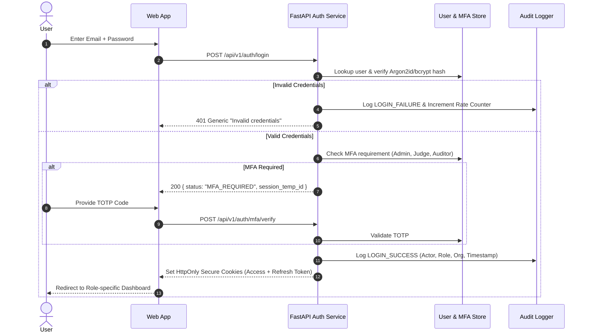
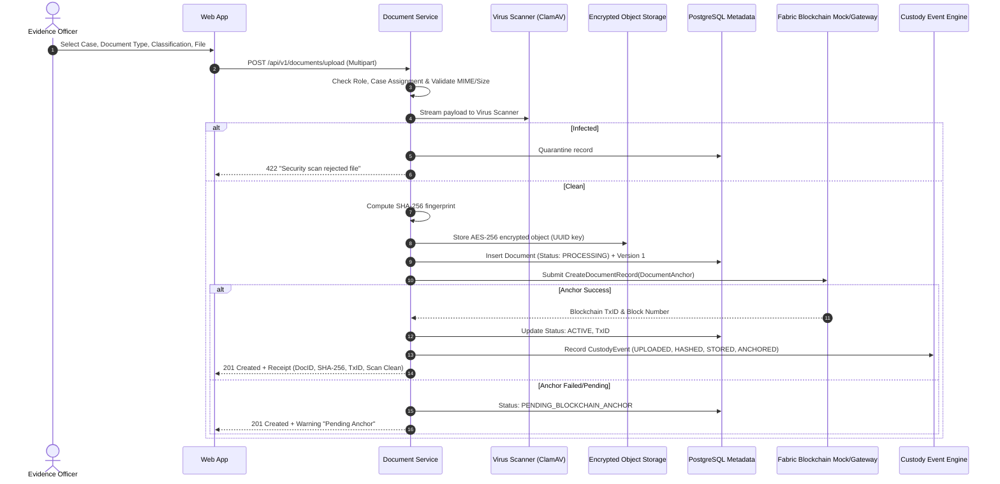
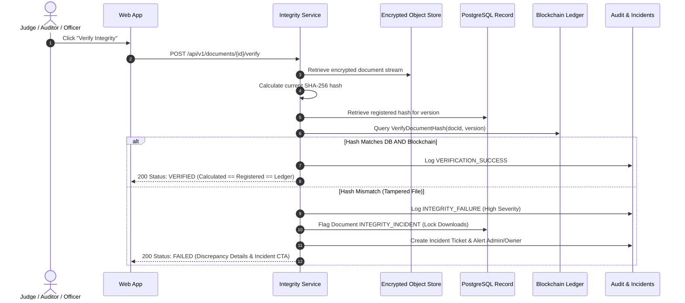

# NyayaVault — Secure Digital Document Management System

[](https://sih.gov.in)
[](docs/security.md)
[](docs/blockchain.md)

> **“Tamper-evident legal and investigation document management with verifiable chain of custody.”**

NyayaVault is an enterprise-grade, defense-in-depth digital document repository engineered for law enforcement agencies, judicial magistrates, forensic investigators, and public prosecutors. It combines **private object storage**, **PostgreSQL search indices**, and **permissioned Hyperledger Fabric cryptographic anchoring** to deliver an uncompromised chain of custody and instant mathematical proof against evidence tampering.

---

## 🏛️ Key System Capabilities

- **Hybrid Storage Architecture**: Binary evidence files are encrypted at rest with AES-256-GCM and stored privately. Only cryptographic SHA-256 fingerprints, version links, and custody actions are anchored to the distributed ledger.
- **8 Institutional Roles with Granular RBAC**: System Administrator, Police / Evidence Officer, Investigating Officer, Forensic Analyst, Prosecutor, Court Clerk, Judge, and Compliance Auditor.
- **Zero-Trust Multi-Factor Authentication (MFA)**: TOTP enforcement on high-privilege roles (Administrator, Judge, Auditor) with HttpOnly secure cookie sessions.
- **Real-Time Cryptographic Verification**: Recalculates file hashes on demand to detect bit-level tampering, with an automated incident management workflow for tampering detection.
- **Tamper-Evident Chain of Custody**: Complete event lifecycle recording (`CREATED`, `HASHED`, `STORED`, `VIEWED`, `DOWNLOADED`, `TRANSFERRED`, `SIGNED`, `VERIFIED`).
- **AI-Assisted OCR, Classification & Redaction**: Automated OCR text extraction and PII redaction suggestions with strict human-in-the-loop review (never altering original evidence).
- **Time-Bound Sharing with Dynamic Watermarking**: Access requests, case-level ACLs, and dynamic watermarking for forensic export compliance.

---

## 📐 System Architecture & Workflows

### 1. Secure Login & Role-Based Session Flow


### 2. Evidence Upload & Blockchain Anchoring Flow


### 3. Document Integrity Verification Flow


---

## 👥 Pre-Seeded Institutional Demo Accounts

All demo accounts share the demonstration password: **`DemoSecurePassword2026!`**

| Role | Email | Official Name | Jurisdiction / Department |
| :--- | :--- | :--- | :--- |
| **System Administrator** | `admin@nyayavault.demo` | Alok Verma | Ministry of Home Affairs / Central IT |
| **Police / Evidence Officer** | `officer@nyayavault.demo` | Insp. Rajesh Sharma | Delhi Police Central Crime Branch |
| **Investigating Officer** | `investigator@nyayavault.demo` | ACP Priya Nair | Cyber Crime Special Cell |
| **Forensic Analyst** | `forensic@nyayavault.demo` | Dr. Anand Swaminathan | Central Forensic Science Laboratory (CFSL) |
| **Prosecutor / Legal** | `prosecutor@nyayavault.demo` | Adv. Meera Joshi | Directorate of Public Prosecutions |
| **Court Clerk** | `clerk@nyayavault.demo` | R. K. Gupta | High Court Registry, Courtroom 4 |
| **Judge** | `judge@nyayavault.demo` | Justice S. K. Roy | Hon'ble High Court Bench |
| **Auditor / Compliance** | `auditor@nyayavault.demo` | Sunita Deshmukh | National Audit & Oversight Directorate |

---

## 🚀 Quick Start Guide

### Option A: Local Development (Instant Start with Python + Node.js)

The platform includes an adaptive local mode with zero external dependencies (using SQLite, local AES-256 encrypted storage, and the mock Fabric ledger):

1. **Clone the repository and copy configuration:**
   ```bash
   cp .env.example .env
   ```

2. **Start the FastAPI Backend (Port 8000):**
   ```bash
   cd apps/api
   pip install -r requirements.txt
   python -m app.db.seed
   python main.py
   ```
   *FastAPI documentation will be available at:* `http://localhost:8000/docs`

3. **Start the Next.js Frontend (Port 3000):**
   ```bash
   cd apps/web
   npm install
   npm run dev
   ```
   *Open application in browser:* `http://localhost:3000`

---

### Option B: Docker Compose (Full Containerized Production Stack)

To run the complete production-grade stack (PostgreSQL 16, Redis, MinIO S3, ClamAV, API, and Web):

```bash
docker compose up -d
```

---

## 📁 Repository Structure

```
nyayavault/
├── apps/
│   ├── api/                   # FastAPI Backend (Python 3.11, SQLAlchemy, Pydantic v2)
│   └── web/                   # Next.js 14 Frontend (App Router, Tailwind CSS, TypeScript)
├── packages/
│   └── blockchain-adapter/    # Hyperledger Fabric Chaincode (Go) & Mock Adapter
├── infra/
│   ├── docker/                # Production Dockerfiles
│   ├── nginx/                 # Reverse proxy & security headers
│   └── fabric/                # Hyperledger network configurations
├── docs/
│   ├── architecture.md        # Deep dive into hybrid architecture
│   ├── security.md            # Security controls, RBAC & compliance
│   ├── threat-model.md        # Threat analysis against 9 attack vectors
│   ├── api.md                 # Full OpenAPI REST documentation
│   ├── blockchain.md          # Hyperledger Fabric ledger models
│   └── demo-script.md         # 5-Minute presentation script for judges
├── docker-compose.yml         # Containerized multi-service deployment
├── Makefile                   # Developer convenience targets
└── README.md
```

---

## 🛡️ Hackathon Demonstration Highlights

1. **Verify Integrity**: Open any case document and click **Verify Integrity** to see live cryptographic validation against the permissioned ledger.
2. **Simulated Tampering Demo**: Open `[DEMO-TAMPERED] Bank Account Summary - Case 102` in documents to witness immediate **RED ALERT - INTEGRITY FAILURE**, automatic asset freezing, and incident dispatch.
3. **Chain of Custody**: View the interactive visual timeline of all custody actions with tamper-evident blockchain transaction IDs.
4. **Digital Signatures**: Sign legal documents with judicial confirmation prompts and cryptographic hash attestation.
5. **AI OCR & Redaction**: Inspect AI suggestions for sensitive entity extraction and generate derived redacted copies while keeping original evidence immutable.
