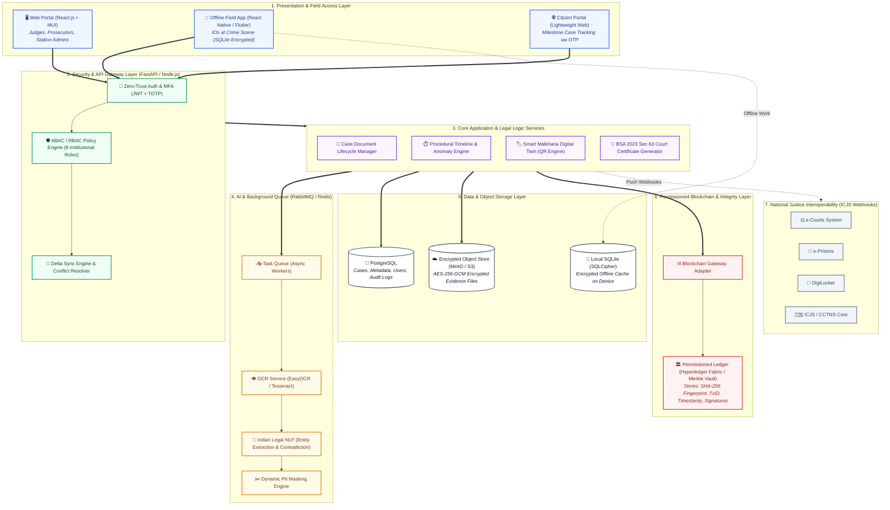
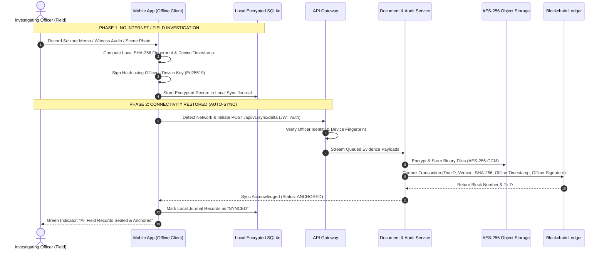
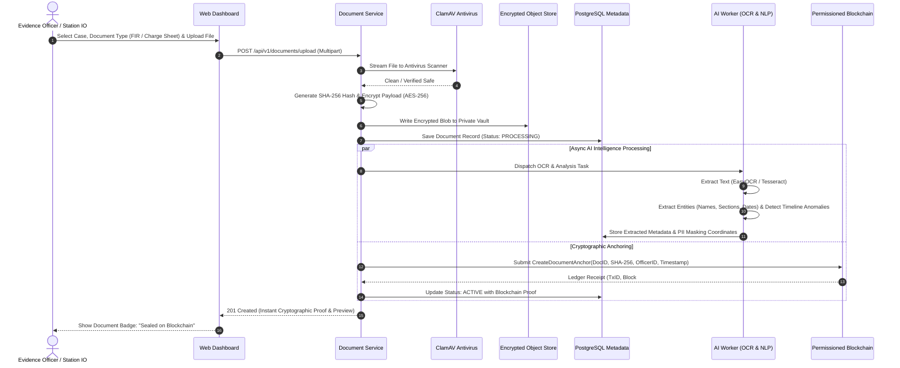
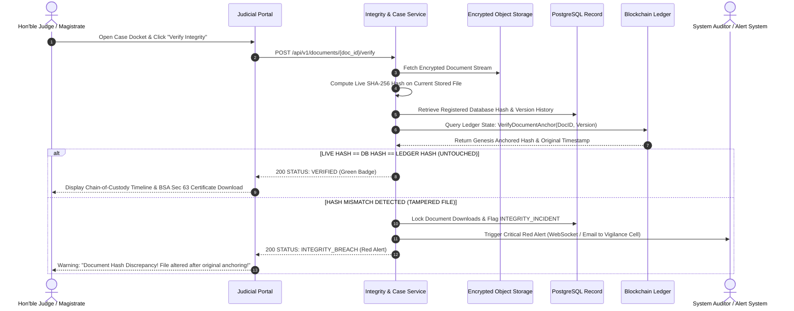
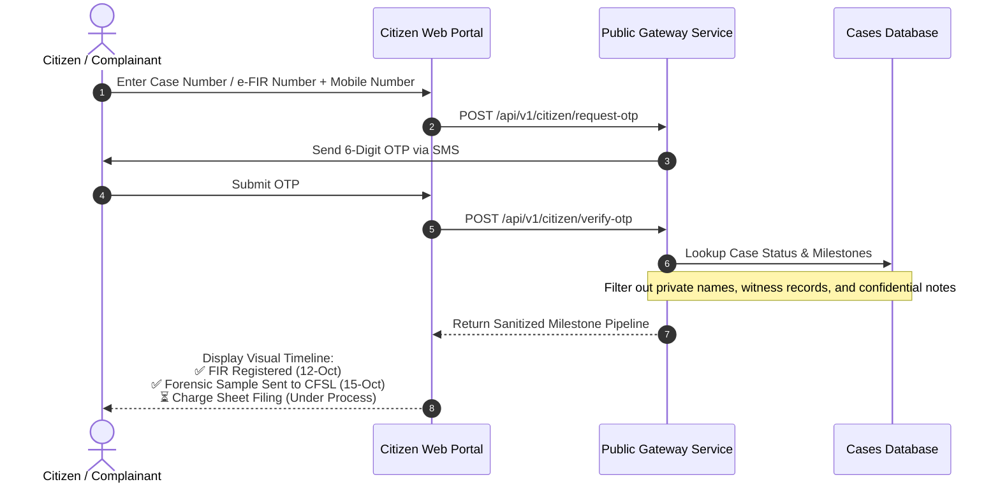

# NyayRaksha — System Architecture & Workflows (SIH26190)

This document contains the complete **System Architecture** and **End-to-End User Flow Diagrams** for the *Secure Digital Document Management System for Legal and Investigation Documents* (Team StithPragya).

---

## 1. System Architecture Diagram

---

## 2. Sequence Diagram: Crime Scene Intake & Offline-to-Online Sync

---

## 3. Sequence Diagram: Document Upload, AI OCR & Blockchain Anchoring

---

## 4. Sequence Diagram: Judicial Integrity Verification & Tampering Alert

---

## 5. Sequence Diagram: Citizen Case Tracking (Zero-Trust Privacy)

